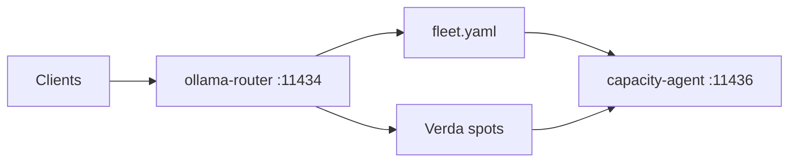

<p align="center">
  
</p>

<p align="center">
  
</p>

<p align="center">
  <strong>Mixed CPU+GPU Ollama-compatible fleet proxy.</strong><br>
  The router process needs no GPU. One listen URL. fleet.yaml hosts plus optional Verda Tailscale GPUs.
</p>

<p align="center">
  <a href="https://github.com/miguelenes/ollama-router/actions/workflows/ci.yml"></a>
  
  
  
  
  
  
  
</p>

<p align="center">
  <a href="#quick-start">Quick start</a>
  &nbsp;·&nbsp;
  <a href="#architecture">Architecture</a>
  &nbsp;·&nbsp;
  <a href="#inventory">Inventory</a>
  &nbsp;·&nbsp;
  <a href="#develop">Develop</a>
</p>

> [!NOTE]
> **0.1.0 preview.** `serve` and `/healthz` ship. The sections below are the product contract this rewrite is landing.

## What it is

Clients speak ordinary Ollama to **one** listen URL (`:11434`). The router load-balances generate, chat, and embed across a mixed CPU+GPU fleet you already run (the router process itself needs **no GPU**), then optionally bursts onto Verda NVIDIA **spot** GPUs on Tailscale.

- **Ollama surface** — `POST /api/generate`, `/api/chat`, `/api/embed` (plus `/api/embeddings` rewritten to `/api/embed` for Ollama ≤0.32). Aggregated `GET /api/tags`. NDJSON streaming.
- **Utilization WLC** — rank by `inflight / capacity`, then RAM pressure, then class preference (embed / small / medium / large). Saturated nodes are never a fallback.
- **fleet.yaml inventory** — `OLLAMA_ROUTER_FLEET` + durable FleetState + Verda. Tunables YAML is tunables only.
- **Verda spots** — cheapest, then smallest GPU inside an inclusive 8–80 GiB VRAM window. Public `:11434` is never healthy.
- **Idle teardown** — router-owned. Only proxied client forwards reset the timer. Health, `/api/ps`, capacity, admin, and the warm-keeper do not count. **Never destroy fleet.yaml hosts.**
- **Capacity miss** — coalesced async Verda `create_additional` (not adopt-first `ensure`). The client gets **503 + `Retry-After`**, never a blocked provision. **v1: one router replica** — two processes sharing FleetState can double-create; do not add Redis.

The sibling capacity agent on `:11436` is not this crate. GiB = bytes / `1024³`.

## Architecture



Cloud Ollama URLs are Tailscale-only. Register a node after OpenSSH and `/api/tags` succeed on the tailnet. Capacity probes are soft-fail and never fake client activity.

## Inventory

Fleet membership is **not** a tunables YAML list. Point `OLLAMA_ROUTER_FLEET` at a GitOps `fleet.yaml` (default `/etc/ollama-router/fleet.yaml`).

| Source | Role |
| --- | --- |
| `OLLAMA_ROUTER_FLEET` / `fleet.yaml` | Permanent hosts (CPU and GPU). Never destroyed on idle. |
| FleetState | Durable Tailscale URLs and Verda metadata |
| Verda manager | Dynamic spot GPUs (not listed in fleet.yaml) |

Point `OLLAMA_ROUTER_CONFIG` at a thin overlay such as [`config.overlay.example.yaml`](config.overlay.example.yaml) to override committed tunables in `router.defaults.yaml`. A top-level `nodes:` key in that overlay is a **hard config error**.

| Knob | Default |
| --- | --- |
| `OLLAMA_ROUTER_HOST` / `OLLAMA_ROUTER_PORT` | `0.0.0.0` / `11434` |
| `OLLAMA_ROUTER_FLEET` | `/etc/ollama-router/fleet.yaml` |
| `OLLAMA_ROUTER_ADMIN_TOKEN` | unset → admin API **403** (no default secret) |

Verda stays **off** until you enable it. Credentials belong in process env, never in YAML. Cloud instance tag `managed_by=ollama-router`.

Permanent hosts stay GitOps: `PUT /router/v1/nodes` upserts a live Verda/adopt row (and may set a Tailscale URL in FleetState) but **never writes fleet.yaml**.

## Operator API

Unauthenticated: `GET /healthz`, `GET /readyz`, `GET /metrics` (Prometheus text 0.0.4). Admin `/router/v1/*` requires `Authorization: Bearer $OLLAMA_ROUTER_ADMIN_TOKEN` (unset → 403).

| Method | Path | Role |
| --- | --- | --- |
| GET | `/router/v1/nodes` | Live inventory (no secrets) |
| PUT | `/router/v1/nodes` | Debug/adopt URL+labels into the live registry |
| GET | `/router/v1/models` | Desired tiers, presence matrix, placement-eligible ids |
| GET | `/router/v1/jobs` | In-memory model operations |
| GET | `/router/v1/jobs/{id}` | One job |
| GET | `/router/v1/stats` | Compact counters/gauges |
| POST | `/router/v1/reload` | Same as SIGHUP: reload fleet.yaml |
| POST | `/router/v1/models/ensure` / `delete` | Placement-aware pull/delete |
| POST | `/router/v1/nodes/provision` | russh provision |
| GET/POST | `/router/v1/verda/{status,ensure,destroy}` | Verda spots |

JSON tracing records `x-request-id` (incoming or generated). Request bodies and prompts are never logged.

## Quick start

Install [Task](https://taskfile.dev/), then:

```bash
task docker
docker run --rm -p 11434:11434 ollama-router:local
curl -fsS http://127.0.0.1:11434/healthz
# {"status":"ok","version":"0.1.0"}

task compose:up
curl -fsS http://127.0.0.1:11435/healthz
curl -fsS http://127.0.0.1:11435/api/tags
curl -fsS http://127.0.0.1:11435/metrics | grep ollama_router_inflight

# generate → gpu mock, embed → cpu mock (both nodes show on Overview / Fleet)
curl -fsS http://127.0.0.1:11435/api/generate \
  -H 'Content-Type: application/json' \
  -d '{"model":"llama3.2:3b","prompt":"hi","stream":false}'
curl -fsS http://127.0.0.1:11435/api/embed \
  -H 'Content-Type: application/json' \
  -d '{"model":"qwen3-embedding:8b","input":"hi"}'

task obs:open
# http://127.0.0.1:3000/d/ollama-router/ollama-router
```

Local compose binds loopback only: router **11435**, Grafana **3000**, Prometheus **9090**. Loki, Alloy, and Alertmanager stay on the compose network. Grafana is anonymous Admin on loopback (no login form). Alloy mounts the Docker socket **read-only** so it can tail the `router` container — local-dev only. `task compose:down` keeps the `grafana-data` volume (no `-v`). `OLLAMA_ROUTER_ADMIN_TOKEN` is unset; `/router/v1/*` returns 403.

## Develop

Local recipes live in [`Taskfile.yml`](Taskfile.yml) (not Make). `check` is sequential so cargo steps do not contend on `target/`.

```bash
task check          # fmt --check, clippy -D warnings, test --locked, cargo deny
cargo test --workspace --locked
```

- **MSRV:** rustc **1.97** (`rust-toolchain.toml`)
- Edition 2021, committed `Cargo.lock`
- rustls only (`deny.toml` bans `openssl` / `native-tls`)
- tracing JSON — never request bodies, prompts, embeddings, or tokens

CLI: `serve`, `ensure`, `delete`, `nodes`, `reload`, `provision`. `ensure`/`delete` print one JSON object per job. `nodes` prints `origin`, id, and URL from fleet.yaml plus FleetState Verda rows. `reload` POSTs `/router/v1/reload` using `OLLAMA_ROUTER_ADMIN_TOKEN`.

Workspace: `crates/ollama-router` (binary / HTTP), `crates/ollama-router-core` (config, fleet, routing, capacity, jobs), `crates/ollama-router-verda` (OAuth2 + spot manager), `crates/ollama-mock` (compose stand-in).

## Sensitivity

Never log or persist prompts, embeddings, `/api/chat` messages, Verda tokens, Tailscale auth keys, SSH private keys, or `OLLAMA_ROUTER_ADMIN_TOKEN`.

Allowlisted operational fields: node id, model name, request class, status, latency, reason codes (`no_healthy`, `saturated`, `public_url_blocked`), instance type, location, spot price, VRAM GiB.

SQLite (`/var/lib/ollama-router/model-operations.sqlite3`) keeps operation id, kind, status, timestamps, and normalized models/nodes. Upstream bodies stay memory-only.

## License

Copyright © ollama-router authors. All rights reserved. This software is **proprietary**; see `license = "proprietary"` in [`Cargo.toml`](Cargo.toml).
