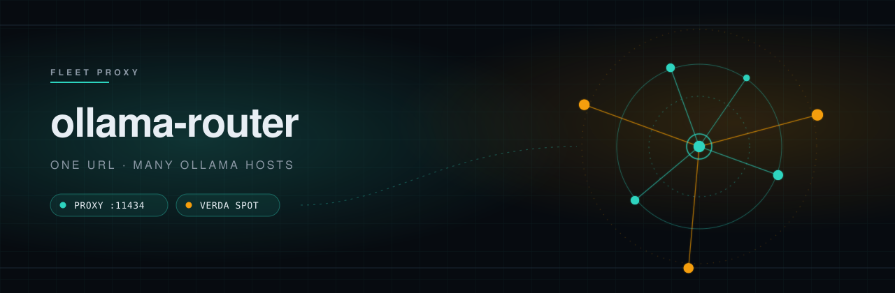
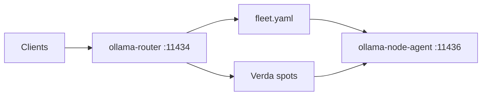

<p align="center">
  
</p>

<p align="center">
  
</p>

<p align="center">
  <strong>Mixed CPU+GPU Ollama-compatible fleet proxy.</strong><br>
  The router process needs no GPU. One listen URL. fleet.yaml hosts plus optional Verda GPUs over a private zrok share.
</p>

<p align="center">
  <a href="https://github.com/miguelenes/ollama-router/actions/workflows/ci.yml"></a>
  
  
  
  
  
  
  
</p>

<p align="center">
  <a href="#quick-start">Quick start</a>
  &nbsp;·&nbsp;
  <a href="#architecture">Architecture</a>
  &nbsp;·&nbsp;
  <a href="#inventory">Inventory</a>
  &nbsp;·&nbsp;
  <a href="#develop">Develop</a>
</p>

> [!NOTE]
> **0.1.0 preview.** `serve` and `/healthz` ship. The sections below are the product contract this rewrite is landing.

## What it is

Clients speak ordinary Ollama to **one** listen URL (`:11434`). The router load-balances generate, chat, and embed across a mixed CPU+GPU fleet you already run (the router process itself needs **no GPU**), then optionally bursts onto Verda NVIDIA **spot** GPUs over a self-hosted zrok **private** share.

- **Ollama surface** — `POST /api/generate`, `/api/chat`, `/api/embed` (plus `/api/embeddings` rewritten to `/api/embed` for Ollama ≤0.32). Aggregated `GET /api/tags` and OpenAI-compatible `GET /v1/models`. NDJSON streaming.
- **Utilization WLC** — rank by `inflight / capacity`, then RAM pressure, then class preference (embed / small / medium / large). Saturated nodes are never a fallback.
- **fleet.yaml inventory** — `OLLAMA_ROUTER_FLEET` + durable FleetState + Verda. Tunables YAML is tunables only.
- **Verda spots** — cheapest, then smallest GPU inside an inclusive 8–80 GiB VRAM window. Public `:11434` and hostname public tunnels (`*.zrok.io` etc.) are never healthy.
- **Idle teardown** — router-owned. Only proxied client forwards reset the timer. Health, `/api/ps`, capacity, admin, and the warm-keeper do not count. **Never destroy fleet.yaml hosts.**
- **Capacity miss** — coalesced async Verda `create_additional` (not adopt-first `ensure`). The client gets **503 + `Retry-After`**, never a blocked provision. **v1: one router replica** — two processes sharing FleetState can double-create; do not add Redis.

- **Node agent on each Ollama host** — `ollama-node-agent` (`setup` elevated, `serve` unprivileged on `:11436`). Shared JSON in `ollama-capacity-types`. GiB = bytes / `1024³`. The router does not install Ollama.

## Architecture



Cloud Ollama URLs are tunnel/loopback-only (self-hosted zrok private share; not `zrok.io`, not public shares). On tunneled hosts, Ollama and the node-agent bind loopback. `setup`/`doctor` print a **find this node** block (share token **id** + enroll status); enroll that share with `POST /router/v1/nodes/enroll` (admin bearer). Enroll does not write `fleet.yaml`. Same-LAN `fleet.yaml` URLs stay direct HTTP. Capacity probes are soft-fail and never fake client activity. Mixed CPU/GPU hosts run **`ollama-node-agent`** (`doctor` / `setup` / `serve`); the router process does not.

## Inventory

Fleet membership is **not** a tunables YAML list. Point `OLLAMA_ROUTER_FLEET` at a GitOps `fleet.yaml` (default `/etc/ollama-router/fleet.yaml`).

| Source | Role |
| --- | --- |
| `OLLAMA_ROUTER_FLEET` / `fleet.yaml` | Permanent hosts (CPU and GPU). Never destroyed on idle. |
| FleetState | Durable enroll/tunnel URLs and Verda metadata |
| Verda manager | Dynamic spot GPUs (not listed in fleet.yaml) |

Point `OLLAMA_ROUTER_CONFIG` at a thin overlay such as [`config.overlay.example.yaml`](config.overlay.example.yaml) to override committed tunables in `router.defaults.yaml`. A top-level `nodes:` key in that overlay is a **hard config error**.

| Knob | Default |
| --- | --- |
| `OLLAMA_ROUTER_HOST` / `OLLAMA_ROUTER_PORT` | `0.0.0.0` / `11434` |
| `OLLAMA_ROUTER_FLEET` | `/etc/ollama-router/fleet.yaml` |
| `OLLAMA_ROUTER_ADMIN_TOKEN` | unset → admin API **403** (no default secret) |
| `OLLAMA_ROUTER_ZROK_API_ENDPOINT` | self-hosted zrok controller (`tunnel.api_endpoint`) |
| `ZROK_ENABLE_TOKEN` | router `zrok enable` (env **value**; YAML names the env via `tunnel.enable_token_env`) |

Verda stays **off** until you enable it. Credentials belong in process env, never in YAML. Cloud instance tag `managed_by=ollama-router`.

Permanent hosts stay GitOps: `PUT /router/v1/nodes` and enroll upsert a live Verda/adopt row (and may set a tunnel URL in FleetState) but **never write fleet.yaml**.

## Operator API

Unauthenticated: `GET /healthz`, `GET /readyz`, `GET /metrics` (Prometheus text 0.0.4). Admin `/router/v1/*` requires `Authorization: Bearer $OLLAMA_ROUTER_ADMIN_TOKEN` (unset → 403).

### Fleet readiness console

Open [`/router/ui`](http://127.0.0.1:11434/router/ui) for the operator console. It polls the consolidated `GET /router/v1/readiness`, node diagnostics, model coverage, and live jobs from the same-origin admin API. The bearer token is held in memory only; it is never placed in local storage, URLs, or logs. The console can recheck health, reload the GitOps inventory, and ensure models, but it never writes `fleet.yaml` or performs destructive fleet operations.

`GET /router/v1/readiness` returns `ready`, `action_required`, or `recovering`, ranked blockers with affected node/model IDs and next actions, counts, and the latest Verda recovery state. `POST /router/v1/readiness/recheck` runs an immediate diagnostic probe without counting as client activity.

| Method | Path | Role |
| --- | --- | --- |
| GET | `/router/v1/nodes` | Live inventory (no secrets) |
| PUT | `/router/v1/nodes` | Debug/adopt URL+labels into the live registry |
| GET | `/router/v1/models` | Desired tiers, presence matrix, placement-eligible ids |
| GET | `/router/v1/jobs` | In-memory model operations |
| GET | `/router/v1/jobs/{id}` | One job |
| GET | `/router/v1/stats` | Compact counters/gauges |
| POST | `/router/v1/reload` | Same as SIGHUP: reload fleet.yaml |
| POST | `/router/v1/models/ensure` / `delete` | Placement-aware pull/delete |
| POST | `/router/v1/nodes/enroll` | Hydrate zrok private-share reachability |
| GET/POST | `/router/v1/verda/{status,ensure,destroy}` | Verda spots |

JSON tracing records `x-request-id` (incoming or generated). Request bodies and prompts are never logged.

## Quick start

Install [Task](https://taskfile.dev/), then:

```bash
task docker
docker run --rm -p 11434:11434 ollama-router:local
curl -fsS http://127.0.0.1:11434/healthz
# {"status":"ok","version":"0.1.0"}

# Host Ollama already on :11434 — router :11435, agent :11436 (does not run setup)
task dev
curl -fsS http://127.0.0.1:11435/healthz
curl -fsS http://127.0.0.1:11435/api/tags
curl -fsS http://127.0.0.1:11435/metrics | grep ollama_router_inflight

curl -fsS http://127.0.0.1:11435/api/generate \
  -H 'Content-Type: application/json' \
  -d '{"model":"llama3.2:3b","prompt":"hi","stream":false}'
curl -fsS http://127.0.0.1:11435/api/embed \
  -H 'Content-Type: application/json' \
  -d '{"model":"qwen3-embedding:8b","input":"hi"}'

task compose:up
task obs:open
# http://127.0.0.1:3000/d/ollama-router/ollama-router
# http://127.0.0.1:3000/d/ollama-router-nodes/ollama-router-nodes
# http://127.0.0.1:3000/d/ollama-router-jobs/ollama-router-jobs
# http://127.0.0.1:3000/d/ollama-router-logs/ollama-router-logs
# http://127.0.0.1:3000/d/ollama-router-verda/ollama-router-verda
# http://127.0.0.1:3000/d/compose-scrapes/compose-scrapes
# http://127.0.0.1:3000/dashboards?tag=stack

# Optional self-hosted zrok (OpenZiti + controller/frontend) on loopback :18080
task zrok:up
# see deploy/zrok/README.md — tokens stay in .local/zrok/.env (not git)
```

`task dev` preflights host Ollama (`GET /api/tags` on `:11434`), then runs `ollama-node-agent serve` on loopback `:11436` and the router on `:11435` with [`deploy/fleet.local.yaml`](deploy/fleet.local.yaml). It does **not** run `setup`. `auto_pull_on_miss` stays **false** so a miss does not pull Hub models onto the real disk.

`task compose:up` is Grafana **3000** / Prometheus **9090** only (loopback). Loki, Alloy, and Alertmanager stay on the compose network. Prometheus scrapes the native router at `host.docker.internal:11435` (router binds `0.0.0.0:11435` so the scrape works). It does **not** scrape `:11436`. `task zrok:up` is a separate optional stack (fetched official OpenZiti + zrok compose in `.local/zrok`); it is not started by `compose:up` and must not be scraped as a node-agent. Grafana is anonymous Admin on loopback (no login form). Grafana **:3000** home is still the fleet overview (`ollama-router.json`). Stack dashboards (Prometheus, Alloy, Loki ingest, Alertmanager, Compose scrapes) are additive — they do not replace home. The Model operations dashboard (`/d/ollama-router-jobs`) shows terminal pull/delete counters, auto-pull wait, and placement/disk — it does not replace the fleet overview home dashboard. The Logs dashboard (`/d/ollama-router-logs`) filters router-container Loki lines (allowlisted fields); native `task dev` has no compose `router` container, so that dashboard is empty unless you use `task compose:mock`. The Verda dashboard (`/d/ollama-router-verda`) covers spot lifecycle and fleet-sum cost; it does not replace the home dashboard or the Nodes inventory table. Alloy mounts the Docker socket **read-only** so it can tail a compose `router` container — mock stack only. `task compose:down` also stops `compose.mock.yaml` and keeps the `grafana-data` volume (no `-v`). `OLLAMA_ROUTER_ADMIN_TOKEN` is unset; `/router/v1/*` returns 403.

No host Ollama: `task compose:mock` builds the canned CPU+GPU mock fleet and a router container on host **11435**. Do not run it at the same time as `task compose:up` (same Grafana/Prometheus ports). Mock compose sets `OLLAMA_ROUTER_AUTO_PULL_ON_MISS=true` so a generate/chat/embed miss enqueues a placement-aware fleet pull (503 `pull_enqueued` + Retry-After). The committed default in `router.defaults.yaml` stays **false**.

## Develop

Local recipes live in [`Taskfile.yml`](Taskfile.yml) (not Make). `check` is sequential so cargo steps do not contend on `target/`.

```bash
task check          # fmt --check, clippy -D warnings, test --locked, cargo deny
task dev            # host Ollama :11434 → router :11435 + agent :11436
task compose:up     # Grafana :3000 / Prometheus :9090 (scrapes host :11435)
task compose:mock   # optional canned CPU+GPU mock fleet (no host Ollama)
task zrok:up        # optional self-hosted zrok controller (loopback :18080)
cargo test --workspace --locked
```

- **MSRV:** rustc **1.97** (`rust-toolchain.toml`)
- Edition 2021, committed `Cargo.lock`
- rustls only (`deny.toml` bans `openssl` / `native-tls`)
- tracing JSON — never request bodies, prompts, embeddings, or tokens

CLI: `serve`, `ensure`, `delete`, `nodes`, `reload`. `ensure`/`delete` print one JSON object per job. `nodes` prints `origin`, `id`, `url`, `tunnel_backend`, and `enroll_age` from fleet.yaml plus FleetState (never share tokens). `reload` POSTs `/router/v1/reload` using `OLLAMA_ROUTER_ADMIN_TOKEN`.

Workspace: `crates/ollama-router` (binary / HTTP), `crates/ollama-router-core` (config, fleet, routing, capacity client, jobs), `crates/ollama-capacity-types` (shared `:11436` JSON), `crates/ollama-node-agent` (node setup + capacity HTTP), `crates/ollama-router-verda` (OAuth2 + spot manager), `crates/ollama-mock` (compose stand-in).

```bash
task agent:doctor   # read-only: backend, Ollama health, listen addresses
task agent:serve    # loopback :11436 via deploy/agent.local.yaml (no setup)
task agent:build
```

`setup` is privileged and idempotent (systemd / LaunchDaemon / Windows Service). `serve` is unprivileged. Do not bind `:11436` to `0.0.0.0` / `listen: all` without a bearer token.

### Node agent packages

Release artifacts (`.github/workflows/release-agent.yml`; locally `task agent:release`, which on Linux uses Docker `rust:1.97-slim-bookworm`; `task agent:release:github` dispatches that workflow via `gh` for Darwin/Windows into `dist/agent/`):

| OS | Install path | Portable |
| --- | --- | --- |
| Linux amd64/arm64 | `ollama-node-agent_<ver>_<arch>.deb` (`apt install`; gnu, glibc ≥ bookworm) | musl static-pie `ollama-node-agent-linux-<arch>.tar.gz` then `sudo ./ollama-node-agent setup` |
| macOS amd64/arm64 | `ollama-node-agent-<ver>-darwin-<arch>.pkg` (LaunchDaemon `com.ollama.node-agent`; agent only) | unsigned zip + `sudo ollama-node-agent setup` |
| Windows amd64 | `ollama-node-agent-<ver>-windows-amd64.msi` (LocalSystem SCM; agent only) | `ollama-node-agent-windows-amd64.exe` then elevated `setup` |

The `.deb` and tarball install the **agent** (binary + unit + `/etc/ollama-node-agent/config.yaml`). They do not download Ollama; run `sudo ollama-node-agent setup` to converge Ollama. Enable zrok with `ZROK_API_ENDPOINT` and `ZROK_ENABLE_TOKEN` in the environment (documented in [`deploy/zrok/README.md`](deploy/zrok/README.md) and the portable Linux README) — not a second VPN. `setup`/`doctor` print a find-this-node block (share token id + enroll status) the installer enrolls; LAN `fleet.yaml` still uses direct URLs. Without systemd, `apt`/`setup` still succeed and print how to run `serve`. The tarball includes optional `contrib/openrc/` (`setup` does not install it). The macOS `.pkg` is a component installer (LaunchDaemon + `/usr/local/bin` + default config); it does not install Ollama.app — `setup` brew-or-fails. After `uninstall`, run `sudo pkgutil --forget com.ollama.node-agent` to drop the receipt (v1 has no uninstall pkg). Unsigned pkgs are fine on a private LAN; Gatekeeper blocks Safari/`xattr` quarantine downloads. The Windows MSI registers a LocalSystem service and writes `C:\ProgramData\ollama-node-agent\config.yaml`; it does not install Ollama or firewall rules — run elevated `ollama-node-agent setup` for those. Do not also run the Ollama tray on `:11434` (NVIDIA under LocalSystem conflicts with a user-session tray). First SCM release deletes leftover `schtasks` named `ollama-node-agent`. Checksums: `SHA256SUMS.txt`. Apple notarize / Authenticode run only when the corresponding secrets are set; unsigned Windows builds may trigger SmartScreen. Local `task agent:release:macos` skips unless Darwin (GHA `macos-14` builds both arches). Local `task agent:release:windows` skips unless the host is `x86_64-pc-windows-msvc` (GHA `windows-latest` is canonical).

## Sensitivity

Never log or persist prompts, embeddings, `/api/chat` messages, Verda tokens, zrok share or enable tokens, SSH private keys, or `OLLAMA_ROUTER_ADMIN_TOKEN`.

Allowlisted operational fields: node id, model name, request class, status, latency, reason codes (`no_healthy`, `saturated`, `public_url_blocked`), instance type, location, spot price, VRAM GiB.

SQLite (`/var/lib/ollama-router/model-operations.sqlite3`) keeps operation id, kind, status, timestamps, and normalized models/nodes. Upstream bodies stay memory-only.

## License

Copyright © ollama-router authors. All rights reserved. This software is **proprietary**; see `license = "proprietary"` in [`Cargo.toml`](Cargo.toml).
